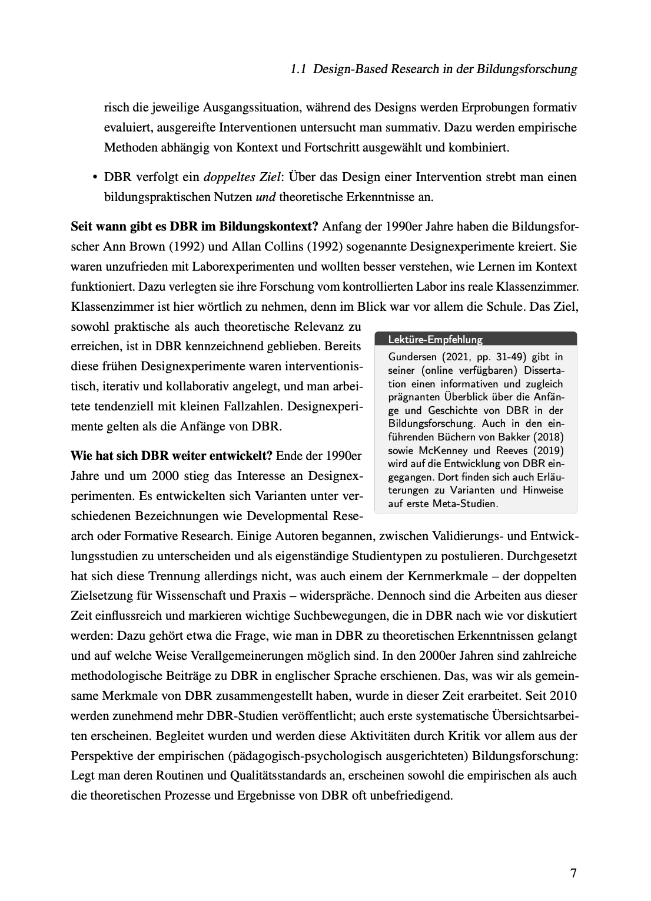

# `wrapText`

Bedauerlicherweise musste ich auf Discord erfahren, dass das Wrapping von Text um eine Textbox momentan in Typst nicht wirklich möglich ist.

https://discord.com/channels/1054443721975922748/1171205428760285275/1171205428760285275

Ich habe diesen Effekt nach zwei Tagen der Suche nach einem geeigneten Paket und einigen Experimenten mit `wrapstuff` und `tcolorbox` realisieren können:

Die Frage ist, ob man feinere Layout-Kontrolle in Typst über primitive Funktionen bekommen könnte. Ich weiß nicht, ob das Konzept der Galleys von Lout (das Typesetting-System von Jeff Kingston) leistungsfähig genug wäre, um als Grundlage für solche Wrapping-Lösungen zu dienen.

Zum Galley-Konzept liegt ein Artikel von [Kahl (1999)](Kahl-1999a.pdf) bei.
